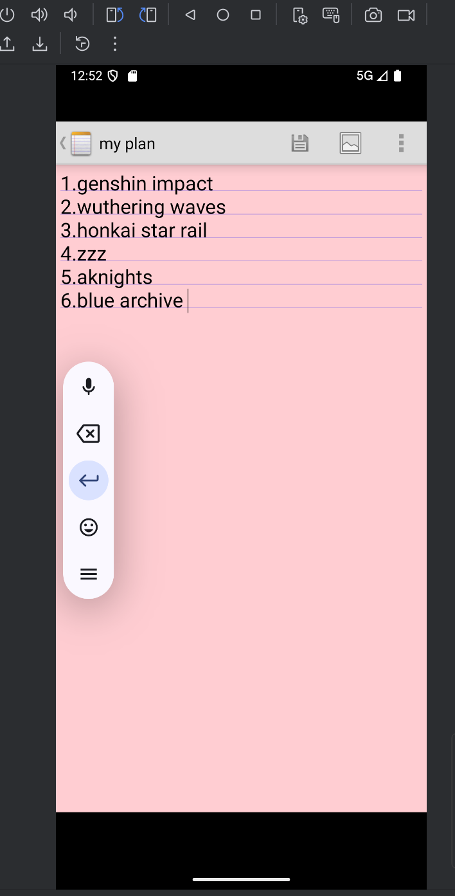
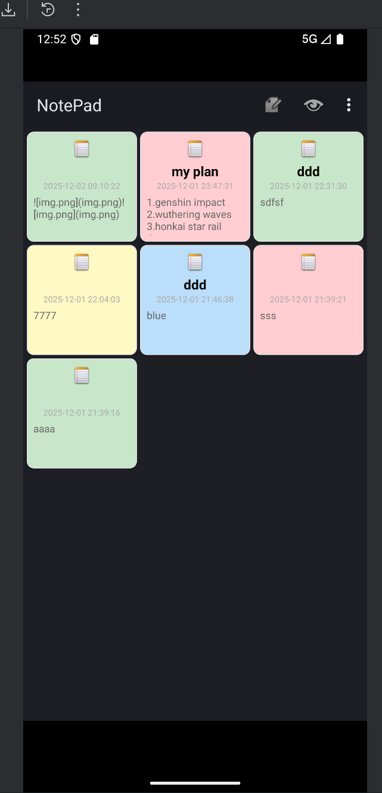
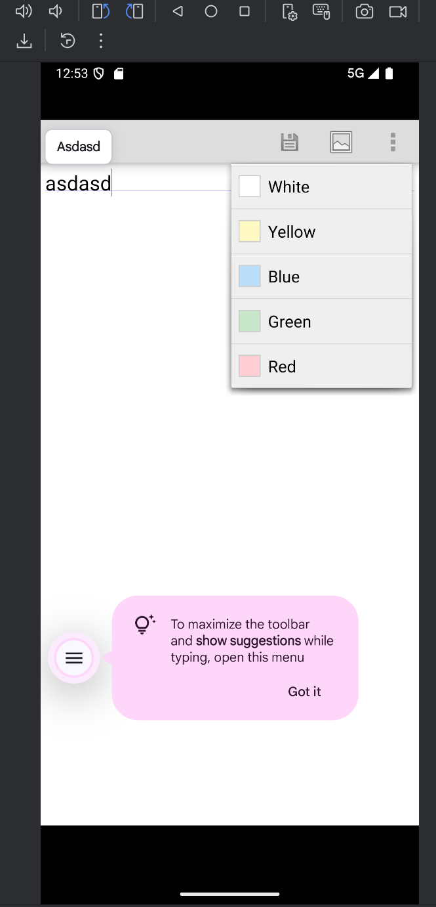

# Android 记事本应用

一个功能完整的Android记事本应用，支持笔记的创建、编辑、删除和管理，提供简洁直观的用户界面和丰富的功能特性。

## 功能特点

- 📝 **笔记管理**：创建、编辑、删除和查看笔记
- 🎨 **颜色主题**：支持多种颜色主题，个性化笔记显示
- 📱 **小部件支持**：将笔记添加到主屏幕，快速访问
- 📂 **实时文件夹**：支持Android实时文件夹功能
- 📋 **列表/网格视图**：支持多种笔记展示方式
- 🔍 **搜索功能**：快速查找笔记内容
- 💾 **数据持久化**：使用ContentProvider进行数据管理

## 技术栈

- **开发语言**：Java
- **开发框架**：Android SDK
- **数据存储**：SQLite (通过ContentProvider)
- **UI组件**：Android原生UI组件
- **构建工具**：Gradle

## 应用截图

### 笔记列表界面


### 笔记编辑界面


### 颜色主题选择


### 小部件配置


### 应用主界面


## 安装方法

### 使用Android Studio安装

1. 克隆或下载本项目到本地
2. 打开Android Studio，选择"Open an existing project"
3. 选择项目目录
4. 等待Gradle同步完成
5. 连接Android设备或启动模拟器
6. 点击"Run"按钮安装应用

### 使用APK安装

1. 构建项目生成APK文件
2. 将APK文件传输到Android设备
3. 在设备上安装APK文件

## 项目结构

```
NotePad/
├── app/
│   ├── src/
│   │   ├── main/
│   │   │   ├── AndroidManifest.xml    # 应用配置文件
│   │   │   ├── java/com/example/android/notepad/    # Java源代码
│   │   │   │   ├── NoteEditor.java    # 笔记编辑活动
│   │   │   │   ├── NotePad.java       # 应用常量定义
│   │   │   │   ├── NotePadProvider.java    # 内容提供者
│   │   │   │   ├── NoteWidgetConfigureActivity.java    # 小部件配置活动
│   │   │   │   ├── NoteWidgetProvider.java    # 小部件提供者
│   │   │   │   ├── NotesList.java      # 笔记列表活动
│   │   │   │   ├── NotesLiveFolder.java    # 实时文件夹
│   │   │   │   ├── SquareLayout.java   # 自定义布局
│   │   │   │   └── TitleEditor.java    # 标题编辑活动
│   │   │   ├── res/                   # 资源文件
│   │   │   │   ├── drawable/          # 图片和可绘制资源
│   │   │   │   ├── layout/            # 布局文件
│   │   │   │   ├── menu/              # 菜单文件
│   │   │   │   ├── values/            # 字符串、颜色等资源
│   │   │   │   └── xml/               # XML配置文件
├── build.gradle                       # 项目构建配置
├── gradle/                            # Gradle包装器
└── settings.gradle                    # 项目设置
```

## 核心功能说明

### 笔记列表管理

NotesList.java是应用的主界面，负责展示所有笔记，支持列表和网格两种视图模式，提供添加新笔记、搜索笔记等功能。

### 笔记编辑

NoteEditor.java和TitleEditor.java负责笔记的编辑功能，支持文本输入、颜色主题选择等特性。

### 数据管理

NotePadProvider.java实现了Android的ContentProvider接口，负责笔记数据的存储和管理，使用SQLite数据库进行持久化存储。

### 小部件功能

NoteWidgetProvider.java和NoteWidgetConfigureActivity.java实现了应用小部件功能，允许用户将笔记添加到主屏幕，快速访问。

## 使用说明

1. **创建新笔记**：在笔记列表界面，点击菜单中的"新建"按钮
2. **编辑笔记**：点击任意笔记进入编辑界面
3. **删除笔记**：长按笔记，选择删除选项
4. **更改颜色主题**：在编辑界面，选择颜色主题
5. **添加小部件**：在主屏幕长按，选择小部件，找到记事本小部件并添加

## 兼容性

支持Android 4.0 (API Level 14)及以上版本。

## 许可证

本项目采用Apache License 2.0许可证，详见LICENSE文件。

## 贡献

欢迎提交Issue和Pull Request来帮助改进这个项目！

---

如果您对这个项目有任何问题或建议，请随时联系我。